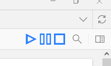
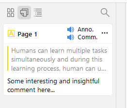

#  ZoTTS
ZoTTS is a Zotero plugin to add TTS functionality

## Install :rocket:

> [!NOTE]
> ZoTTS is only available for Zotero 7+ due to major differences between the two versions.
> If you want to use ZoTTS and need to download Zotero 7, it's available [here](https://www.zotero.org/support/beta_builds).
> Be aware that Zotero 7 in still in beta version right now.

> The latest stable version is available [here](https://github.com/ImperialSquid/zotero-zotts/releases/latest)
> The full version list, including prerelease versions is [here](https://github.com/ImperialSquid/zotero-zotts/releases)

1. Download the .xpi file from the [latest release](https://github.com/ImperialSquid/zotero-zotts/releases)
   - If you're using firefox, right click and select "Save as..."
2. In Zotero, go to `Tools > Plugins`
3. Click the gear icon in the top right
4. Select `Install Add-on From File...`
5. Browse to the downloaded .xpi file and select it

The plugin should load straight away, and future updates will be downloaded automatically!

## Features :sparkles:
### Shortcuts
- `Ctrl/Cmd + S` will begin **s**peaking (extra functionality is available with `Ctrl/Cmd + Shift + S`, discussed below)
- `Ctrl/Cmd + Shift + P` will **p**ause
- `Ctrl/Cmd + Shift + C` will **c**ancel

In the Library tab, by default `Ctrl/Cmd + S` will speak a paper's title, `Ctrl/Cmd + Shift + S` will speak its abstract.

In Reader tabs, `Ctrl/Cmd (+ Shift) + S` will speak any selected text within the document. If no text is selected but some annotations are selected `Ctrl/Cmd + S` will speak their annotated text, `Ctrl/Cmd + Shift + S` will speak the attached comment if there is one.

You can swap the behaviour of `Ctrl/Cmd + S` and `Ctrl/Cmd + Shift + S` in the preferences.

### UI Elements
In Reader tabs there's also buttons for playing/pausing/cancelling in the top right. These will act the same as using the speak/pause/cancel shortcuts in terms of speaking selected text/annotations, however, when speaking annotations it will default to speaking the annotated text.

On each annotation there are also buttons to speak the annotated text, and the comment if one exists.

### Preferences
In the preferences you can:
- **Enable/disable queueing** - if you want to speak a new item, should ZoTTS add it to a queue, or cancel the current item and speak the new one?
- **Adjust the current voice and related settings**
  - Voices used are the ones built in to your computer
  - You can also adjust the rate/pitch/volume
- **Tweak shortcuts**
  - Rebind the speak, pause and cancel shortcuts to use other letters
  - Change what happens when you're holding `Ctrl/Cmd` vs `Ctrl/Cmd + Shift`

## Contributing :wrench:
Refer to the [contribution guide](docs/CONTRIBUTING.md) for details on setting up your environment and places to start!